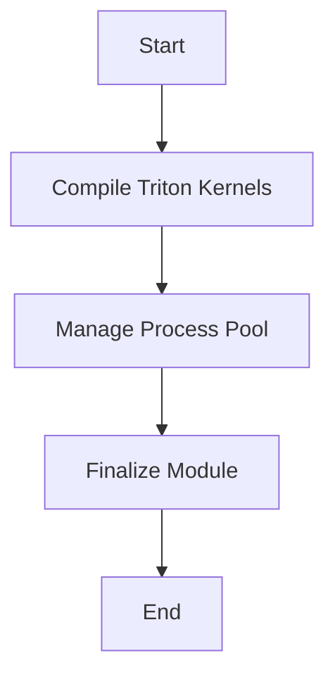

This document will cover the Triton Compilation Process, which includes:

1. Compiling Triton Kernels
2. Managing the Process Pool
3. Finalizing the Module

Technical document: <SwmLink doc-title="Triton Compilation Process">[Triton Compilation Process](/.swm/triton-compilation-process.b7p9mlce.sw.md)</SwmLink>

# [Compiling Triton Kernels](https://app.swimm.io/repos/Z2l0aHViJTNBJTNBcHl0b3JjaC1hdXRvZG9jcy1kZW1vJTNBJTNBU3dpbW0tRGVtbw==/docs/b7p9mlce#triton-compilation)

The Triton function is responsible for compiling specific types of code called Triton kernels. Initially, it logs the source code of the kernel. This step is important for tracking and debugging purposes. Next, it sets up the necessary environment for compilation by configuring the Triton PTXAS path. This ensures that the compilation process has access to the required tools and libraries. If there are multiple threads available for compilation, the task is sent to a group of worker processes to handle it in parallel. This parallel processing speeds up the compilation process. If multiple threads are not available, the kernel is compiled directly. This process ensures that the code is ready to run efficiently on the hardware.

# [Managing the Process Pool](https://app.swimm.io/repos/Z2l0aHViJTNBJTNBcHl0b3JjaC1hdXRvZG9jcy1kZW1vJTNBJTNBU3dpbW0tRGVtbw==/docs/b7p9mlce#process-pool-management)

The process pool function manages a pool of worker processes for parallel compilation. It creates a process pool using either a subprocess-based pool or a multiprocessing-based pool, depending on the configuration. This pool is used to submit compilation tasks in parallel, which enhances the efficiency and speed of the compilation process. By managing the process pool, the system can handle multiple compilation tasks simultaneously, reducing the overall time required for compilation.

# [Finalizing the Module](https://app.swimm.io/repos/Z2l0aHViJTNBJTNBcHl0b3JjaC1hdXRvZG9jcy1kZW1vJTNBJTNBU3dpbW0tRGVtbw==/docs/b7p9mlce#finalizing-the-module)

The Finalize function cleans up and optimizes a quantized module. It clears profiling information, inserts prepack and unpack operations, performs quantization fusion, freezes the module, and folds quantized prepacking operations. This ensures that the module is optimized and ready for execution. By finalizing the module, the system ensures that the compiled code is efficient and performs well on the target hardware.

&nbsp;

*This is an auto-generated document by Swimm AI 🌊 and has not yet been verified by a human*

<SwmMeta version="3.0.0" repo-id="Z2l0aHViJTNBJTNBcHl0b3JjaC1hdXRvZG9jcy1kZW1vJTNBJTNBU3dpbW0tRGVtbw==" repo-name="pytorch-autodocs-demo">Powered by [Swimm](https://app.swimm.io/)</SwmMeta>
