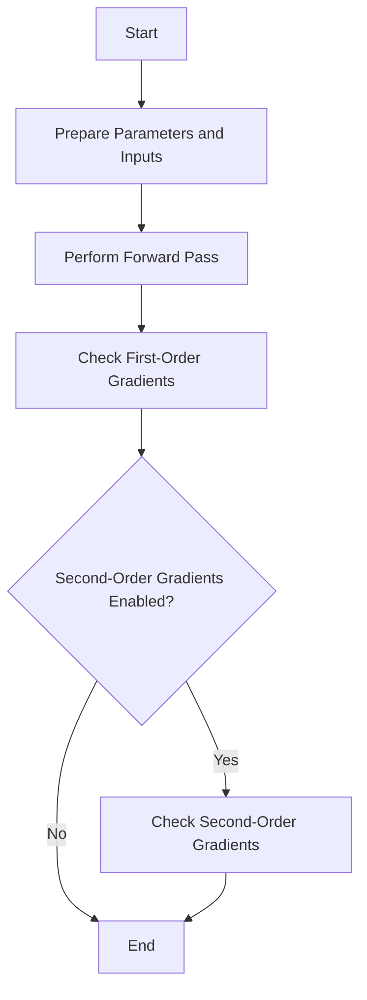

This document will cover the process of verifying gradient correctness in a neural network module. We'll cover:

1. Preparing parameters and inputs
2. Performing forward passes
3. Checking first-order gradients
4. Checking second-order gradients

Technical document: <SwmLink doc-title="Verifying Gradient Correctness">[Verifying Gradient Correctness](/.swm/verifying-gradient-correctness.102uq1k8.sw.md)</SwmLink>

# [Preparing Parameters and Inputs](https://app.swimm.io/repos/Z2l0aHViJTNBJTNBcHl0b3JjaC1hdXRvZG9jcy1kZW1vJTNBJTNBU3dpbW0tRGVtbw==/docs/102uq1k8#preparing-parameters-and-inputs)

The process begins by preparing the parameters and inputs for the neural network module. This involves gathering all the necessary parameters that the module will use during the forward pass. These parameters are essential as they define the behavior and structure of the neural network. Inputs are also prepared, which are the data points that will be fed into the network for processing.

# [Performing Forward Passes](https://app.swimm.io/repos/Z2l0aHViJTNBJTNBcHl0b3JjaC1hdXRvZG9jcy1kZW1vJTNBJTNBU3dpbW0tRGVtbw==/docs/102uq1k8#performing-forward-passes)

A forward pass is performed through the neural network module. This step involves passing the prepared inputs through the network to obtain the output. The forward pass is crucial as it simulates the actual operation of the network during training or inference, allowing us to observe how the inputs are transformed into outputs.

# [Checking First-Order Gradients](https://app.swimm.io/repos/Z2l0aHViJTNBJTNBcHl0b3JjaC1hdXRvZG9jcy1kZW1vJTNBJTNBU3dpbW0tRGVtbw==/docs/102uq1k8#checking-first-order-gradients)

First-order gradients are checked to ensure their correctness. This involves comparing the analytical gradients (computed using backpropagation) with numerical gradients (computed using finite differences). The comparison helps in identifying any discrepancies between the two, which could indicate issues in the gradient computation logic. If the module has sparse gradients, a special check is performed to handle these cases.

# [Checking Second-Order Gradients](https://app.swimm.io/repos/Z2l0aHViJTNBJTNBcHl0b3JjaC1hdXRvZG9jcy1kZW1vJTNBJTNBU3dpbW0tRGVtbw==/docs/102uq1k8#checking-second-order-gradients)

If second-order gradient checks are enabled, the gradients of gradients are also verified. This step ensures the correctness of second-order gradients, which are essential for certain optimization algorithms and advanced neural network architectures. The process involves computing the second-order gradients and comparing them with numerically approximated second-order gradients to ensure they match within a specified tolerance.

&nbsp;

*This is an auto-generated document by Swimm AI 🌊 and has not yet been verified by a human*

<SwmMeta version="3.0.0" repo-id="Z2l0aHViJTNBJTNBcHl0b3JjaC1hdXRvZG9jcy1kZW1vJTNBJTNBU3dpbW0tRGVtbw==" repo-name="pytorch-autodocs-demo">Powered by [Swimm](https://app.swimm.io/)</SwmMeta>
