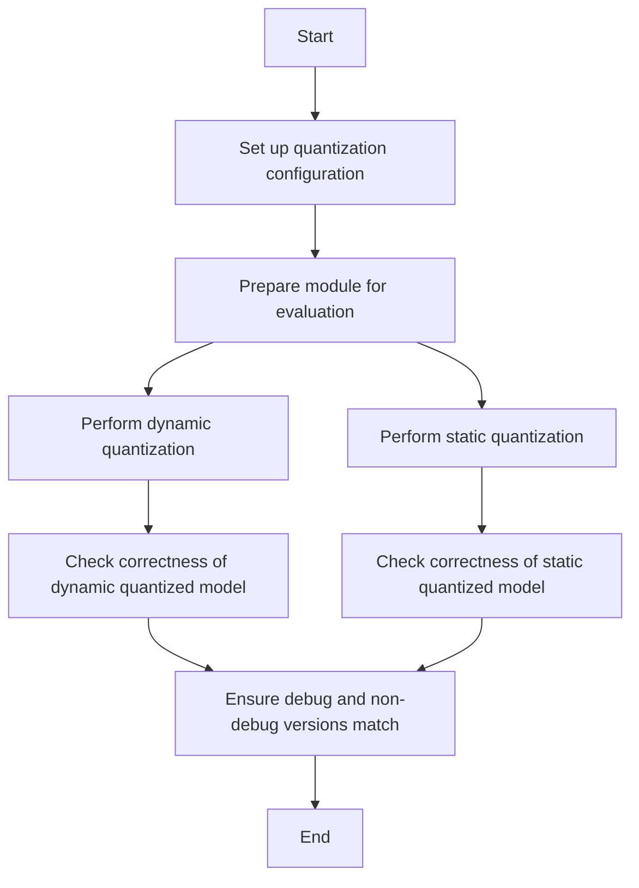

This document will cover the process of verifying the quantization of a module using the checkGraphModeOp function. We'll cover:

1. Setting up the quantization configuration
2. Preparing the module for evaluation
3. Performing dynamic and static quantization
4. Ensuring the correctness of the quantized model

Technical document: <SwmLink doc-title="Overview of checkGraphModeOp">[Overview of checkGraphModeOp](/.swm/overview-of-checkgraphmodeop.osk7zlac.sw.md)</SwmLink>

# [Setting up the quantization configuration](https://app.swimm.io/repos/Z2l0aHViJTNBJTNBcHl0b3JjaC1hdXRvZG9jcy1kZW1vJTNBJTNBU3dpbW0tRGVtbw==/docs/osk7zlac#checkgraphmodeop)

The first step in the checkGraphModeOp function is to set up the quantization configuration. This involves defining the quantization parameters that will be used for the module. The configuration includes details such as the type of quantization (dynamic or static) and the specific quantization settings for different parts of the module. This step is crucial because it ensures that the module is prepared with the correct settings for the subsequent quantization process.

# [Preparing the module for evaluation](https://app.swimm.io/repos/Z2l0aHViJTNBJTNBcHl0b3JjaC1hdXRvZG9jcy1kZW1vJTNBJTNBU3dpbW0tRGVtbw==/docs/osk7zlac#checkgraphmodeop)

Once the quantization configuration is set up, the next step is to prepare the module for evaluation. This involves converting the module into a format that can be evaluated and quantized. The module is set to evaluation mode, which disables certain training-specific behaviors and optimizes the module for inference. This step ensures that the module is in the correct state for the quantization process.

# [Performing dynamic and static quantization](https://app.swimm.io/repos/Z2l0aHViJTNBJTNBcHl0b3JjaC1hdXRvZG9jcy1kZW1vJTNBJTNBU3dpbW0tRGVtbw==/docs/osk7zlac#checkgraphmodeop)

The checkGraphModeOp function performs two types of quantization: dynamic and static. Dynamic quantization is applied to parts of the module that benefit from runtime quantization, such as linear layers. Static quantization, on the other hand, is applied to parts of the module that can be quantized during the calibration phase. This step ensures that the module is optimized for both types of quantization, improving its performance and efficiency.

# [Ensuring the correctness of the quantized model](https://app.swimm.io/repos/Z2l0aHViJTNBJTNBcHl0b3JjaC1hdXRvZG9jcy1kZW1vJTNBJTNBU3dpbW0tRGVtbw==/docs/osk7zlac#checkgraphmodeop)

After performing the quantization, the checkGraphModeOp function verifies that the quantized model runs correctly. This involves running the quantized model with test inputs and comparing the outputs to ensure they match the expected results. Additionally, the function checks that both the debug and non-debug versions of the quantized model produce the same results. This step is essential for ensuring the reliability and accuracy of the quantized model.

&nbsp;

*This is an auto-generated document by Swimm AI 🌊 and has not yet been verified by a human*

<SwmMeta version="3.0.0" repo-id="Z2l0aHViJTNBJTNBcHl0b3JjaC1hdXRvZG9jcy1kZW1vJTNBJTNBU3dpbW0tRGVtbw==" repo-name="pytorch-autodocs-demo">Powered by [Swimm](https://app.swimm.io/)</SwmMeta>
