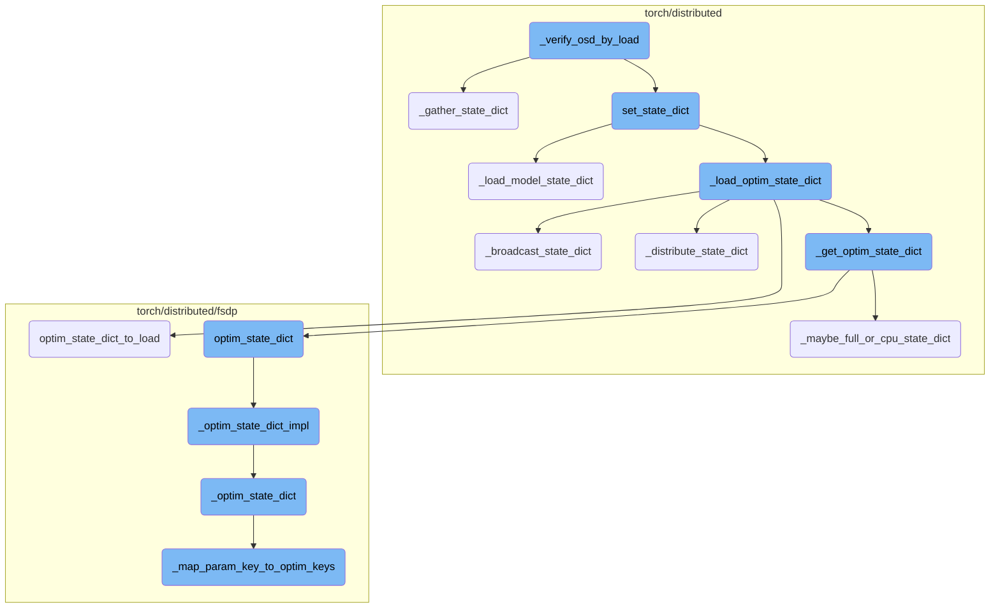
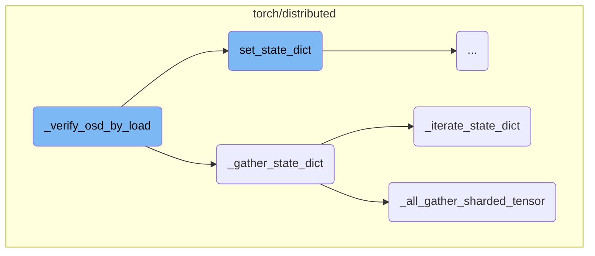
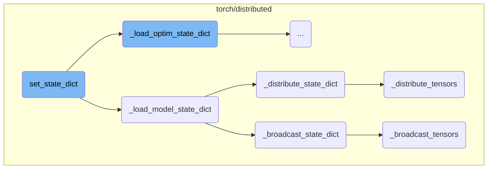
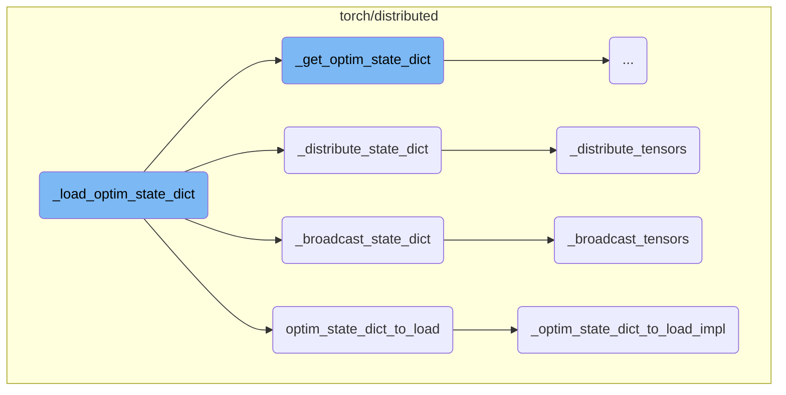
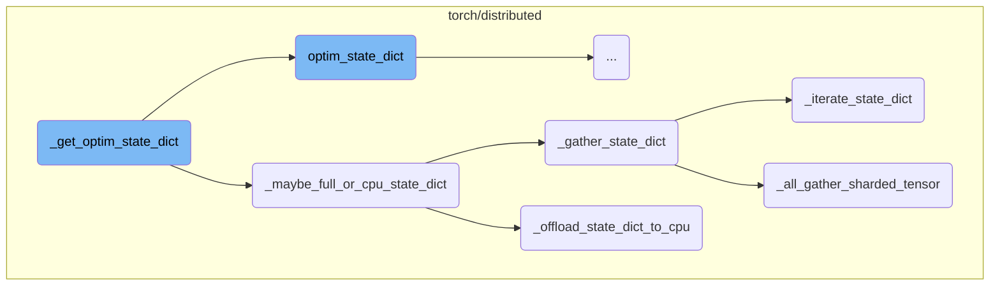
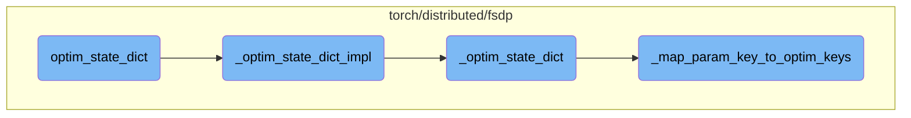

This document provides an overview of the process involved in verifying the optimizer state dictionary (OSD) by loading it into a new optimizer and comparing it with the original optimizer's state dictionary. The process ensures that the state dictionaries are consistent and correctly loaded.

The process starts by gathering the state dictionary using a specific function. Then, the state dictionary is set for both the model and the new optimizer. Finally, the state dictionaries of the original and new optimizers are compared to ensure they are equal. This verification process helps maintain the integrity of the optimizer state across different training sessions.

Here is a high level diagram of the flow, showing only the most important functions:



# Flow drill down

First, we'll zoom into this section of the flow:



<SwmSnippet path="/torch/testing/_internal/distributed/common_state_dict.py" line="110">

---

## \_verify_osd_by_load

The function `_verify_osd_by_load` is responsible for verifying the optimizer state dictionary (OSD) by loading it into a new optimizer and comparing it with the original optimizer's state dictionary. It first gathers the state dictionary using `_gather_state_dict`, then sets the state dictionary for the model and the new optimizer using `set_state_dict`, and finally asserts that the state dictionaries of the original and new optimizers are equal.

```python
        new_dist_osd = _gather_state_dict(dist_osd)
        set_state_dict(
            model,
            optimizers=new_optim,
            model_state_dict={},
            optim_state_dict=new_dist_osd,
        )
        self.assertEqual(optim.state_dict(), new_optim.state_dict())
```

---

</SwmSnippet>

<SwmSnippet path="/torch/distributed/_state_dict_utils.py" line="205">

---

## \_gather_state_dict

The function `_gather_state_dict` gathers all the ShardedTensors or DTensors in the provided state dictionary. It applies specific functions to handle ShardedTensors and DTensors, ensuring they are gathered correctly. This function is crucial for consolidating the state dictionary from distributed components before it can be used for verification or further processing.

```python
def _gather_state_dict(
    state_dict: Dict[str, Any],
    *,
    pg: Optional[dist.ProcessGroup] = None,
    device: Optional[torch.device] = None,
    cpu_offload: bool = False,
    ranks_only: Tuple[int, ...] = (),
    type_check: bool = True,
) -> Dict[str, Any]:
    """
    Given a state_dict, this API gathers all the ShardedTensors or DTensors in
    the state_dict.


    Args:
        state_dict (Dict[str, Any]): the target sharded state_dict.
        pg (Optional[dist.ProcessGroup]): the process group that is used to
            gather ShardedTensor. Note that gathering a DTensor will use
            the DeviceMesh. So this argument will be ignored when gathering a
            DTensor.
        device: (Optional[torch.device]): the device that is used to
```

---

</SwmSnippet>

<SwmSnippet path="/torch/distributed/_state_dict_utils.py" line="84">

---

### \_iterate_state_dict

The function `_iterate_state_dict` iterates through the state dictionary and applies the provided functions to each tensor type. It handles different types of tensors, including ShardedTensors, DTensors, and regular Tensors, ensuring they are processed correctly based on their type. This function is used within `_gather_state_dict` to apply the necessary gathering operations.

```python
def _iterate_state_dict(
    iter_object: Any,
    sharded_tensor_func: Callable,
    dtensor_func: Callable,
    tensor_func: Callable,
    *,
    pg: Optional[dist.ProcessGroup] = None,
    device: Optional[torch.device] = None,
    cpu_offload: bool = False,
    companion_obj: Any = None,
    ranks_only: Tuple[int, ...] = (),
    type_check: bool = True,
    non_blocking: bool = True,
) -> Dict[str, Any]:
    """Iterate through the state dict, applying the given functions to each tensor type.

    Args:
        iter_object (Any): the target state_dict.
        sharded_tensor_func (Callable): the function to apply to ShardedTensor
        dtensor_func (Callable): the function to apply to DTensor
        tensor_func (Callable): the function to apply to Tensor
```

---

</SwmSnippet>

<SwmSnippet path="/torch/distributed/_state_dict_utils.py" line="42">

---

### \_all_gather_sharded_tensor

The function `_all_gather_sharded_tensor` gathers a ShardedTensor across all ranks in the process group. It ensures that the tensor is correctly gathered and reshaped to its original size. This function is used within `_gather_state_dict` to handle the gathering of ShardedTensors specifically.

```python
def _all_gather_sharded_tensor(
    sharded_tensor: "ShardedTensor",
    pg: Optional[dist.ProcessGroup] = None,
    device: Optional[torch.device] = None,
) -> torch.Tensor:
    if pg is None:
        pg = distributed_c10d._get_default_group()
    world_size = dist.get_world_size(pg)
    shards = sharded_tensor.local_shards()
    dim_0_size = sharded_tensor.size()[0]  # type: ignore[index]
    tensor_numel = sharded_tensor.size().numel()  # type: ignore[union-attr]
    chunk_size = math.ceil(dim_0_size / world_size) * tensor_numel // dim_0_size
    pg_device = (
        distributed_c10d._get_pg_default_device(pg) if device is None else device
    )
    if shards:
        local_tensor = shards[0].tensor.flatten()
        if local_tensor.device.type != pg_device.type:
            local_tensor = local_tensor.to(pg_device)
        num_padding = chunk_size - local_tensor.numel()
        if num_padding > 0:
```

---

</SwmSnippet>

Now, lets zoom into this section of the flow:



## Loading and Distributing State Dictionaries

The `set_state_dict` function is responsible for loading the state dictionaries for both the model and the optimizers. It ensures that the provided state dictionaries meet specific requirements and then proceeds to load them into the model and optimizers. This function is crucial for restoring the state of a model and its optimizers from a saved checkpoint.

<SwmSnippet path="/torch/distributed/checkpoint/state_dict.py" line="533">

---

### Loading Model State Dictionary

The `_load_model_state_dict` function handles the loading of the model's state dictionary. It processes the state dictionary, ensuring that it is correctly formatted and then loads it into the model. If broadcasting is required, it calls `_broadcast_state_dict` to handle the distribution of the state dictionary across different devices.

```python
def _load_model_state_dict(
    model: nn.Module,
    state_dict: Dict[str, ValueType],
    info: _StateDictInfo,
) -> _IncompatibleKeys:
    if not info.handle_model or (not state_dict and not info.broadcast_from_rank0):
        return _IncompatibleKeys({}, {})

    local_state_dict = {}
    for key, value in _iterate_valid_model_state(model):
        fqns = _get_fqns(model, key)
        fqns_with_prefix = _get_fqns(
            model, key, skip_ddp_prefix=False, skip_compiler_prefix=False
        )

        for fqn, fqn_with_prefix in zip(fqns, fqns_with_prefix):
            if (
                not info.broadcast_from_rank0 or dist.get_rank() == 0
            ) and fqn != fqn_with_prefix:
                state_dict[fqn_with_prefix] = state_dict.pop(fqn)
            local_state_dict[fqn_with_prefix] = value
```

---

</SwmSnippet>

<SwmSnippet path="/torch/distributed/_state_dict_utils.py" line="559">

---

### Broadcasting State Dictionary

The `_broadcast_state_dict` function is responsible for broadcasting the state dictionary from the rank 0 process to all other processes. This ensures that all processes have a consistent view of the state dictionary. It handles both tensor and non-tensor values, broadcasting them appropriately.

```python
def _broadcast_state_dict(
    full_state_dict: Dict[str, Any],
    local_state_dict: Dict[str, Any],
    device: torch.device,
    pg: Optional[dist.ProcessGroup] = None,
    strict: bool = False,
) -> None:
    # Broadcast from rank0's `full_state_dict` to all ranks' `local_state_dict`.
    # If strict is True, any keys in `local_state_dict` but not in `full_state_dict`
    # will be removed from `local_state_dict`.
    ret = {}
    if dist.get_rank() == 0:
        for key, value in full_state_dict.items():
            if not torch.is_tensor(value):
                ret[key] = value
            elif value.dim() == 0:
                ret[key] = value.cpu()
            else:
                ret[key] = _TensorInfo(value.size(), value.dtype)

    broadcast_list = [ret]
```

---

</SwmSnippet>

<SwmSnippet path="/torch/distributed/_state_dict_utils.py" line="612">

---

### Distributing State Dictionary

The `_distribute_state_dict` function distributes the state dictionary across different devices. It ensures that each rank has the full state dictionary and then distributes the tensors to the appropriate devices. This function is essential for parallel training, where different devices need to have access to the model's state.

```python
def _distribute_state_dict(
    full_state_dict: Dict[str, Any],
    local_state_dict: Dict[str, Any],
    device: torch.device,
    pg: Optional[dist.ProcessGroup] = None,
) -> None:
    # Full_state_dict = True, broadcast_from_rank0 = False here. Each rank has
    # full_state_dict. Skip the broadcast in ``_broadcast_state_dict`` and
    # distribute tensors in each rank
    for key, value in full_state_dict.items():
        if key not in full_state_dict:
            continue
        if not torch.is_tensor(value):
            local_state_dict[key] = value
        elif value.dim() == 0:
            local_state_dict[key] = value.cpu()
        else:
            assert isinstance(value, torch.Tensor)
            full_tensor = value.detach().to(device)
            local_state = local_state_dict.get(key, None)
            if local_state is None:
```

---

</SwmSnippet>

<SwmSnippet path="/torch/distributed/_state_dict_utils.py" line="539">

---

### Distributing Tensors

The `_distribute_tensors` function is called by `_distribute_state_dict` to handle the distribution of individual tensors. It ensures that tensors are distributed according to the specified device mesh and placements, facilitating efficient parallel training.

```python
def _distribute_tensors(
    local_state_dict: Dict[str, Any],
    keys: List[str],
    device: torch.device,
    pg: Optional[dist.ProcessGroup] = None,
) -> None:
    if pg is None:
        pg = dist.distributed_c10d._get_default_group()
    for key in keys:
        _local_state = local_state_dict.get(key, None)
        if _local_state is None or torch.is_tensor(_local_state):
            continue

        local_state = _local_state[0]
        full_tensor = _local_state[1]
        local_state_dict[key] = distribute_tensor(
            full_tensor, local_state.device_mesh, local_state.placements
        )
```

---

</SwmSnippet>

<SwmSnippet path="/torch/distributed/_state_dict_utils.py" line="498">

---

### Broadcasting Tensors

The `_broadcast_tensors` function is responsible for broadcasting tensors from the rank 0 process to all other processes. It ensures that all processes have a consistent view of the tensors, which is crucial for synchronized training across multiple devices.

```python
def _broadcast_tensors(
    full_state_dict: Dict[str, Any],
    local_state_dict: Dict[str, Any],
    keys: List[str],
    device: torch.device,
    pg: Optional[dist.ProcessGroup] = None,
) -> None:
    tensors = []
    for key in keys:
        if dist.get_rank() == 0:
            full_state = full_state_dict[key]
            assert isinstance(full_state, torch.Tensor)
            full_tensor = full_state.detach().to(device)
        else:
            tensor_info = full_state_dict[key]
            full_tensor = torch.empty(
                size=tensor_info.size,
                device=device,
                dtype=tensor_info.dtype,
            )

```

---

</SwmSnippet>

Now, lets zoom into this section of the flow:



<SwmSnippet path="/torch/distributed/checkpoint/state_dict.py" line="869">

---

## \_load_optim_state_dict

The `_load_optim_state_dict` function is responsible for loading the optimizer state dictionary into the optimizer. It first initializes the optimizer state and then processes the state dictionary based on whether it is flattened or not. If the model uses FullyShardedDataParallel (FSDP), it handles the conversion of Fully Qualified Names (FQNs) to ensure compatibility. The function also manages the broadcasting or distribution of the state dictionary across devices if required.

```python
def _load_optim_state_dict(
    model: nn.Module,
    optimizers: Tuple[torch.optim.Optimizer, ...],
    state_dict: OptimizerStateType,
    info: _StateDictInfo,
) -> None:
    if not info.handle_optim:
        return

    for optim in optimizers:
        _init_optim_state(optim)
        if state_dict:
            if _STATE in state_dict:
                optim_state_dict = _split_optim_state_dict(
                    model, optim, state_dict, info
                )
            else:
                optim_state_dict = _unflatten_optim_state_dict(
                    optim, cast(Dict[str, ValueType], state_dict), info
                )
        else:
```

---

</SwmSnippet>

<SwmSnippet path="/torch/distributed/fsdp/fully_sharded_data_parallel.py" line="1891">

---

## optim_state_dict_to_load

The `optim_state_dict_to_load` function converts an optimizer state dictionary so that it can be loaded into the optimizer associated with the FSDP model. It ensures that the state dictionary is compatible with the sharded model and can be loaded directly if specified. This function is crucial for maintaining the integrity of the optimizer state across distributed training setups.

```python
    def optim_state_dict_to_load(
        model: torch.nn.Module,
        optim: torch.optim.Optimizer,
        optim_state_dict: Dict[str, Any],
        is_named_optimizer: bool = False,
        load_directly: bool = False,
        group: Optional[dist.ProcessGroup] = None,
    ) -> Dict[str, Any]:
        """
        Convert an optimizer state-dict so that it can be loaded into the optimizer associated with the FSDP model.

        Given a ``optim_state_dict`` that is transformed through
        :meth:`optim_state_dict`, it gets converted to the flattened optimizer
        state_dict that can be loaded to ``optim`` which is the optimizer for
        ``model``. ``model`` must be sharded by FullyShardedDataParallel.

            >>> # xdoctest: +SKIP("undefined variables")
            >>> from torch.distributed.fsdp import FullyShardedDataParallel as FSDP
            >>> from torch.distributed.fsdp import StateDictType
            >>> from torch.distributed.fsdp import FullStateDictConfig
            >>> from torch.distributed.fsdp import FullOptimStateDictConfig
```

---

</SwmSnippet>

<SwmSnippet path="/torch/distributed/fsdp/fully_sharded_data_parallel.py" line="1298">

---

## \_optim_state_dict_to_load_impl

The `_optim_state_dict_to_load_impl` function is an internal API used by all load optimizer state dictionary implementations. It adds FSDP internal information and sharding details to the optimizer state dictionary, ensuring that it can be correctly loaded into the optimizer. This function handles the intricacies of sharding and parameter mapping, making it essential for distributed training scenarios.

```python
    def _optim_state_dict_to_load_impl(
        optim_state_dict: Dict[str, Any],
        model: torch.nn.Module,
        optim_input: Optional[
            Union[
                List[Dict[str, Any]],
                Iterable[torch.nn.Parameter],
            ]
        ] = None,
        optim: Optional[torch.optim.Optimizer] = None,
        full_state_dict: bool = True,
        rank0_only: bool = False,
        is_named_optimizer: bool = False,
        group: Optional[dist.ProcessGroup] = None,
    ) -> Dict[str, Any]:
        """
        Convert an optimizer state-dict so that it can be loaded into the optimizer associated with the FSDP model.

        This is the internal API that is used by all the load optim_state_dict implementations.
        Given model, optim, and the saved optim_state_dict, this API adds the FSDP
        internal information and internal sharding to the optim_state_dict.
```

---

</SwmSnippet>

Now, lets zoom into this section of the flow:



<SwmSnippet path="/torch/distributed/checkpoint/state_dict.py" line="738">

---

## \_get_optim_state_dict

The `_get_optim_state_dict` function is responsible for gathering the state dictionaries of optimizers associated with a model. It initializes the optimizer state, handles specific cases for Fully Sharded Data Parallel (FSDP) modules, and performs necessary key conversions for FlatParameter FSDP. The function then updates the optimizer state dictionary and, if required, flattens it before passing it to `_maybe_full_or_cpu_state_dict` for further processing.

```python
    if not info.handle_optim:
        return {}

    optim_state_dict: OptimizerStateType = {_STATE: {}, _PG: []}
    for optim in optimizers:
        _init_optim_state(optim)
        osd = _state_dict_fn(optim, "state_dict")()
        if info.fsdp_modules:
            with info.fsdp_context():
                osd = FSDP.optim_state_dict(model, optim, osd)

            # We need to specially handle FlatParameter FSDP as
            # FlatParameter FSDP converts the FQNs.
            # There are no easy ways to do this conversion systematically.
            # We can only use a string replacment without correctness check.
            if not osd:
                continue
            for k in list(osd[_STATE].keys()):
                if "_orig_mod" in k:
                    osd[_STATE][k.replace("_orig_mod.", "")] = osd[_STATE].pop(k)
            for g in osd[_PG]:
```

---

</SwmSnippet>

<SwmSnippet path="/torch/distributed/checkpoint/state_dict.py" line="446">

---

## \_maybe_full_or_cpu_state_dict

The `_maybe_full_or_cpu_state_dict` function determines whether the state dictionary should be gathered across all ranks or offloaded to CPU memory. If `info.full_state_dict` is true, it gathers the state dictionary using `_gather_state_dict`. If `info.cpu_offload` is true, it offloads the state dictionary to CPU using `_offload_state_dict_to_cpu`. Otherwise, it returns the state dictionary as is.

```python
def _maybe_full_or_cpu_state_dict(
    state_dict: Dict[str, Any], info: _StateDictInfo
) -> Dict[str, Any]:
    if info.full_state_dict:
        ranks_only = (
            ()
            if (not info.cpu_offload or not torch.distributed.is_initialized())
            else (0,)
        )
        return _gather_state_dict(
            state_dict, cpu_offload=info.cpu_offload, ranks_only=ranks_only
        )
    elif info.cpu_offload:
        return _offload_state_dict_to_cpu(state_dict)
    else:
        return state_dict
```

---

</SwmSnippet>

<SwmSnippet path="/torch/distributed/_state_dict_utils.py" line="293">

---

## \_offload_state_dict_to_cpu

The `_offload_state_dict_to_cpu` function offloads all tensors in the state dictionary to CPU memory. It iterates over the state dictionary and applies the offloading operation, ensuring that only the specified ranks (if any) retain the state dictionary while others get empty dictionaries. This function is useful for reducing GPU memory usage by moving the state dictionary to CPU.

```python
def _offload_state_dict_to_cpu(
    state_dict: Dict[str, Any],
    *,
    ranks_only: Tuple[int, ...] = (),
    type_check: bool = True,
) -> Dict[str, Any]:
    """
    Given a state_dict, this API offload all the tensors to CPU memory.

    Args:
        state_dict (Dict[str, Any]): the target state_dict.
        pg (Optional[dist.ProcessGroup]): the process group that is used to
            gather ShardedTensor. Note that gathering a DTensor will use
            the DeviceMesh. So this argument will be ignored when gathering a
            DTensor.
        ranks_only: (Tuple[int, ...]): if this tuple is empty, all ranks will
            have the same state_dicts. Otherwise only ranks that in ``ranks_only``
            have the same state_dicts. Other ranks will get empty state_dicts.
        type_check: (bool): check if the instance data type is a supported type
            that can be saved by DCP.  The current supported data types are
            torch.Tensor, DTensor, int, float, str, list, dict, None.
```

---

</SwmSnippet>

Now, lets zoom into this section of the flow:



<SwmSnippet path="/torch/distributed/fsdp/fully_sharded_data_parallel.py" line="1795">

---

## Transforming Optimizer State Dictionary

The `optim_state_dict` function transforms the state dictionary of an optimizer corresponding to a sharded model. It can convert the state dictionary into three types: full, sharded, or local. This transformation is crucial for handling different states of the optimizer efficiently, especially in distributed training scenarios.

```python
    def optim_state_dict(
        model: torch.nn.Module,
        optim: torch.optim.Optimizer,
        optim_state_dict: Optional[Dict[str, Any]] = None,
        group: Optional[dist.ProcessGroup] = None,
    ) -> Dict[str, Any]:
        """
        Transform the state-dict of an optimizer corresponding to a sharded model.

        The given state-dict can be transformed to one of three types:
        1) full optimizer state_dict, 2) sharded optimizer state_dict, 3) local optimizer state_dict.

        For full optimizer state_dict, all states are unflattened and not sharded.
        Rank0 only and CPU only can be specified via :meth:`state_dict_type` to
        avoid OOM.

        For sharded optimizer state_dict, all states are unflattened but sharded.
        CPU only can be specified via :meth:`state_dict_type` to further save
        memory.

        For local state_dict, no transformation will be performed. But a state
```

---

</SwmSnippet>

<SwmSnippet path="/torch/distributed/fsdp/fully_sharded_data_parallel.py" line="1241">

---

## Internal Implementation of Optimizer State Dictionary Transformation

The `_optim_state_dict_impl` function is an internal API used by all `optim_state_dict` implementations. It removes internal information and sharding from the optimizer state dictionary, ensuring that the state dictionary is correctly transformed based on the specified configuration.

```python
    def _optim_state_dict_impl(
        model: torch.nn.Module,
        optim: torch.optim.Optimizer,
        optim_state_dict: Dict[str, Any],
        optim_input: Optional[
            Union[
                List[Dict[str, Any]],
                Iterable[torch.nn.Parameter],
            ]
        ] = None,
        rank0_only: bool = True,
        full_state_dict: bool = True,
        group: Optional[dist.ProcessGroup] = None,
        cpu_offload: bool = True,
        *,
        _stacklevel: int = 1,
    ) -> Dict[str, Any]:
        """Transform the state-dict of an optimizer corresponding to a sharded model.

        This is the internal API that is used by all the optim_state_dict implementations.
        Given model, optim, the original optim_state_dict, this API removes the
```

---

</SwmSnippet>

<SwmSnippet path="/torch/distributed/fsdp/_optim_utils.py" line="1869">

---

## Consolidating Optimizer State

The `_optim_state_dict` function consolidates the optimizer state and returns it as a dictionary. It maps flat parameters back to their unflattened parameters and handles various configurations like sharding and CPU offloading. This function ensures that the optimizer state is correctly represented and can be saved or loaded efficiently.

```python
def _optim_state_dict(
    model: nn.Module,
    optim: torch.optim.Optimizer,
    optim_state_dict: Dict[str, Any],
    optim_input: Optional[
        Union[
            List[Dict[str, Any]],
            Iterable[nn.Parameter],
        ]
    ],
    rank0_only: bool,
    shard_state: bool,
    group: Optional[dist.ProcessGroup],
    using_optim_input: bool,
    use_orig_params: bool = False,
    cpu_offload: bool = True,
) -> Dict[str, Any]:
    """
    Consolidates the optimizer state and returns it as a :class:`dict`
    following the convention of :meth:`torch.optim.Optimizer.state_dict`,
    i.e. with keys ``"state"`` and ``"param_groups"``.
```

---

</SwmSnippet>

<SwmSnippet path="/torch/distributed/fsdp/_optim_utils.py" line="1194">

---

## Mapping Parameter Keys to Optimizer Keys

The `_map_param_key_to_optim_keys` function constructs the local mapping between optimizer state keys and parameter keys. It ensures that all optimizer state keys are correctly mapped across ranks, which is essential for distributed training. This function handles the merging of keys and checks for any missing keys on each rank.

```python
def _map_param_key_to_optim_keys(
    optim_state_dict: Dict[str, Any],
    group: Optional[dist.ProcessGroup],
    param_key_to_param: Dict[Union[int, str], nn.Parameter],
    param_to_fqns: Dict[nn.Parameter, List[str]],
    fqn_to_fsdp_param_info: Dict[str, FSDPParamInfo],
    merge_keys: bool = False,
) -> Tuple[List[_OptimStateKey], Dict[_OptimStateKey, Union[int, str]]]:
    """
    Construct the local mapping between the ``_OptimStateKey`` and parameter keys
    and all the ``_OptimStateKey`` across ranks. If ``merge_keys`` is False, rank0
    must contain all the ``_OptimStateKey``, an exception will be raised otherwise.
    Note that ``merge_keys`` should equal to ``use_orig_params``.
    """
    rank = dist.get_rank(group)
    optim_state_key_to_param_key: Dict[_OptimStateKey, Union[int, str]] = {}  # local
    all_optim_state_keys: List[_OptimStateKey] = []

    for param_key, param in param_key_to_param.items():
        # Do not include parameters without state to avoid empty mappings
        # just like in normal `torch.optim.Optimizer.state_dict()`
```

---

</SwmSnippet>

&nbsp;

*This is an auto-generated document by Swimm AI 🌊 and has not yet been verified by a human*

<SwmMeta version="3.0.0" repo-id="Z2l0aHViJTNBJTNBcHl0b3JjaC1hdXRvZG9jcy1kZW1vJTNBJTNBU3dpbW0tRGVtbw==" repo-name="pytorch-autodocs-demo"><sup>Powered by [Swimm](https://app.swimm.io/)</sup></SwmMeta>
